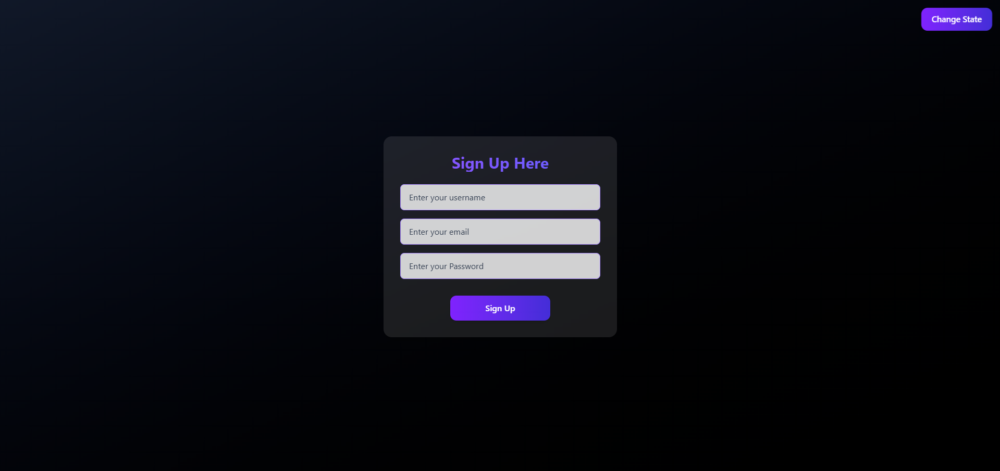

# Component Rendering

Different component is rendered as soon as the Change state button is Triggered. 

---

## Demo / Preview

<!-- Add a screenshot, video, or link to live demo -->
  

---

## Features

- Uses States for Rendering
- Useful in learning about State Changes and Logical Rendering (Including Terinary operator and Logical Operators)

---

## Tech Stack

**Client:** React / Tailwindcss
---

### Prerequisites

- Node.js / 

### Installation

# Clone the repository
git clone https://github.com/adityakalra007/ComponentRendering.git

# Move into the project folder
cd ComponentRendering

# Install dependencies
npm install 

# Start the project
npm run dev 